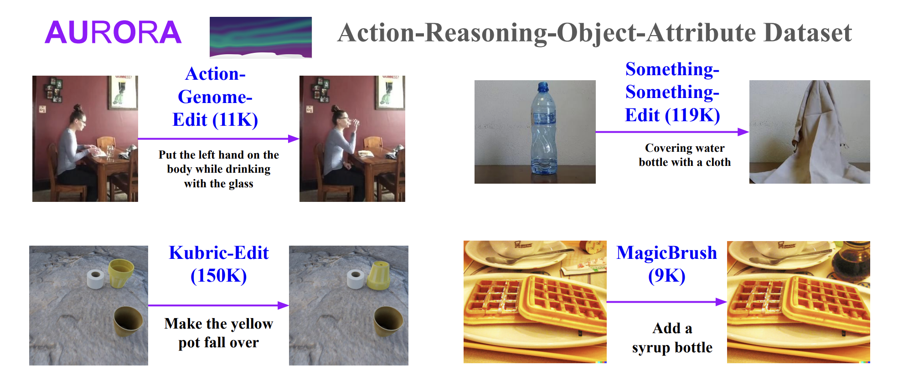

# *AURORA: Learning Action and Reasoning-Centric Image Editing from Videos and Simulation*

[](https://Website.com)
[](https://arxiv.org/abs/123.123)
[](https://huggingface.co/collections/McGill-NLP/TODO)
[](https://huggingface.co/collections/McGill-NLP/TODO)
[](https://github.com/McGill-NLP/AURORA/blob/main/LICENSE)

AURORA (Action Reasoning Object Attribute) enables training an instruction-guided image editing model that can perform action and reasoning-centric edits, on top of the "simpler" established object, attribute or global edits. Here we release 1) training data, 2) trained model, 3) benchmark, 4) reproducible training and evaluation.

<p align="center">
  
</p>


## TODOs
- [x] Training ataset access
- [ ] Benchmark access
- [ ] Human ratings
- [ ] Push code for inference
- [ ] Push clean code for reproducing training and evaluation
- [ ] Create a demo of our model
- [ ] Acknowledgements: Something Something, AG, Kubric, EQBEN, MagicBrush (!!)

## Data

On the data side, we release three artifacts:
1. The training dataset (AURORA)
2. A benchmark for testing diverse editing skills (AURORA-Bench): object-centric, action-centric, reasoning-centric, and global edits
3. Human ratings on AURORA-Bench, i.e. for other researchers working image editing metrics

### Training Data (AURORA)

Download the images easily via zenodo:
```
wget https://zenodo.org/record/11552426/files/ag_images.zip
wget https://zenodo.org/record/11552426/files/kubric_images.zip
wget https://zenodo.org/record/11552426/files/magicbrush_images.zip
```

Now put them into their respective directory `data/NAME` and rename them images.zip.
So in the end you should have `data/kubric/images` as a directory etc.

For Something-Something-Edit, you need to go to the [original source](https://developer.qualcomm.com/software/ai-datasets/something-something) and download all the zip files and put *all* the videos in a folder named `videos/`. Then run `data/something/extract_frames.py`, as well as as `data/something/filter_keywords.py`.

For each sub-dataset of AURORA, an entry would look like this:


```json
[
  {
    "instruction": "Leave the door while standing closer",
    "input": "data/ag/images/1K0SU.mp4_4_left.png",
    "output": "data/ag/images/1K0SU.mp4_4_right.png"
  },
  {"..."}
]
```
### Benchmark: AURORA-Bench

For measuring how well models do on various editing skills (action, reasoning, object/attribute, global), we introduce AURORA-Bench hosted here on this repository under `test.json` with the respective images under `data/TASK/images/`.

### Human Ratings

## Inference

## Training

## Reproduce Evaluation

## Acknowledgements, License, Citation
