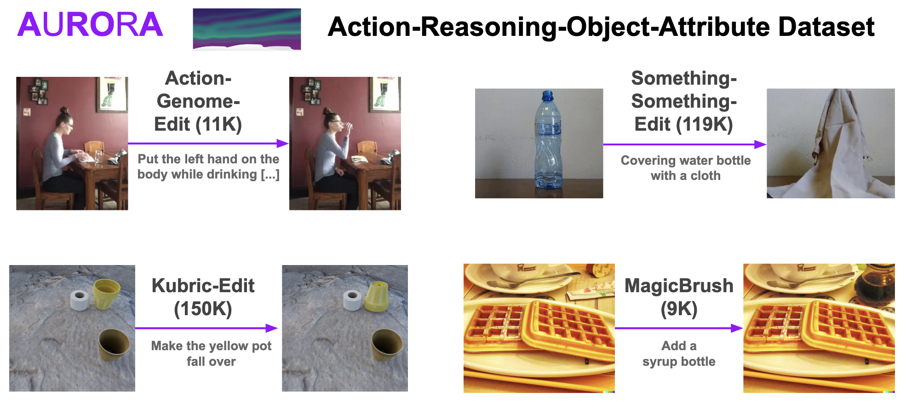

# *AURORA: Learning Action and Reasoning-Centric Image Editing from Videos and Simulation*

[](https://Website.com)
[](https://arxiv.org/abs/123.123)
[](https://huggingface.co/collections/McGill-NLP/AURORA)
[](https://huggingface.co/collections/McGill-NLP/aurora-bench)
[](https://huggingface.co/collections/McGill-NLP/TODO)
[](https://github.com/McGill-NLP/AURORA/blob/main/LICENSE)

AURORA (Action Reasoning Object Attribute) enables training an instruction-guided image editing model that can perform action and reasoning-centric edits, in addition to "simpler" established object, attribute or global edits. Here we release 1) training data, 2) trained model, 3) benchmark, 4) reproducible training and evaluation.

<p align="center">
  
</p>

Please reach out to [benno.krojer@mila.quebec](mailto:benno.krojer@mila.quebec) or raise an issue if anything does not work!

## TODOs
- [x] Training dataset access
- [x] Benchmark access
- [x] Human ratings
- [x] Push code for inference & training
- [x] Acknowledgements
- [ ] Push code for reproducing evaluation
- [ ] Create a demo of our model
- [ ] Huggingface ecosystem

## Data

On the data side, we release three artifacts and a [Datasheet documentation](https://github.com/McGill-NLP/AURORA/blob/main/datasheet.md):
1. The training dataset (AURORA)
2. A benchmark for testing diverse editing skills (AURORA-Bench): object-centric, action-centric, reasoning-centric, and global edits
3. Human ratings on AURORA-Bench, i.e. for other researchers working image editing metrics

### Training Data (AURORA)

The edit instructions are stored as `data/TASK/train.json` for each of the four tasks.

For the image pairs, you can download them easily via zenodo:
```
wget https://zenodo.org/record/11552426/files/ag_images.zip
wget https://zenodo.org/record/11552426/files/kubric_images.zip
wget https://zenodo.org/record/11552426/files/magicbrush_images.zip
```

Now put them into their respective directory `data/NAME` and rename them images.zip.
So in the end you should have `data/kubric/images` as a directory etc.

For Something-Something-Edit, you need to go to the [original source](https://developer.qualcomm.com/software/ai-datasets/something-something) and download all the zip files and put *all* the videos in a folder named `videos/`. Then run `data/something/extract_frames.py`, as well as as `data/something/filter_keywords.py`.

For each sub-dataset of AURORA, an entry would look like this:


```json
[
  {
    "instruction": "Leave the door while standing closer",
    "input": "data/ag/images/1K0SU.mp4_4_left.png",
    "output": "data/ag/images/1K0SU.mp4_4_right.png"
  },
  {"..."}
]
```
### Benchmark: AURORA-Bench

For measuring how well models do on various editing skills (action, reasoning, object/attribute, global), we introduce AURORA-Bench hosted here on this repository under `test.json` with the respective images under `data/TASK/images/`.

### Human Ratings

We also release human ratings of image editing outputs on AURORA-Bench examples, which forms the basis of our main evaluation in the paper.
The output images and assocaciated human ratings (`task_scores_finegrained.json`) can be downloaded from Google Drive: [Link](https://drive.google.com/file/d/1sT0rerhrSLWlSsiw1BsO1ALbGssqEBpz/view?usp=sharing)

## Running stuff

Similar to [MagicBrush](https://github.com/OSU-NLP-Group/MagicBrush) we adopt the [pix2pix codebase](https://github.com/timothybrooks/instruct-pix2pix) for running and training models.

### Inference

Please create a python environment and install the requirements.txt file (it is unfortunately important to use 3.9 due to taming-transformers):
```
python3.9 -m venv env
pip3 install -r reqirements.txt
```

You can download our trained checkpoint from Google Drive: [Link](https://drive.google.com/file/d/1omV0xGyX6rVx1gp2EFgdcK8qSw1gUcnx/view?usp=sharing), place it in the main directory and run our AURORA-trained model on an example image:
```
python3 edit_clip.py
```

### Training
To reproduce our training, first download an initial checkpoint that is the reproduced MagicBrush model: [Google Drive Link](https://drive.google.com/file/d/1qwkRwsa9jJu1uyYkaWOGL1CpXWlBI1jN/view?usp=sharing)

Due to weird versioning of libraries/python, you have to go to `env/src/taming-transformers/taming/data/utils.py` and comment out line 11: `from torch._six import string_classes`.

Now you can run run the the train script (hyperparameters can be changed under `configs/finetune_magicbrush_ag_something_kubric_15-15-1-1_init-magic.yaml`):

```
python3 main.py --gpus 0,
```

Specify more gpus with i.e. `--gpus 0,1,2,3`.


## Reproduce Evaluation

## Acknowledgements, License & Citation

We use the [MIT License](https://github.com/McGill-NLP/AURORA/blob/main/LICENSE).

We want to thank several repositories that made our life much easier on this project:

1. The [MagicBrush](https://github.com/OSU-NLP-Group/MagicBrush) and [InstructPix2Pix](https://github.com/timothybrooks/instruct-pix2pix) code base and datasets, especially the correspondance with MagicBrush authors helped us a lot.
2. The dataset/engines we use to build AURORA: [Something Something v2](https://developer.qualcomm.com/software/ai-datasets/something-something), [Action-Genome](https://github.com/JingweiJ/ActionGenome) and [Kubric](https://github.com/google-research/kubric)
3. Source code from [EQBEN](https://github.com/Wangt-CN/EqBen) for generating images with the Kubric engine
